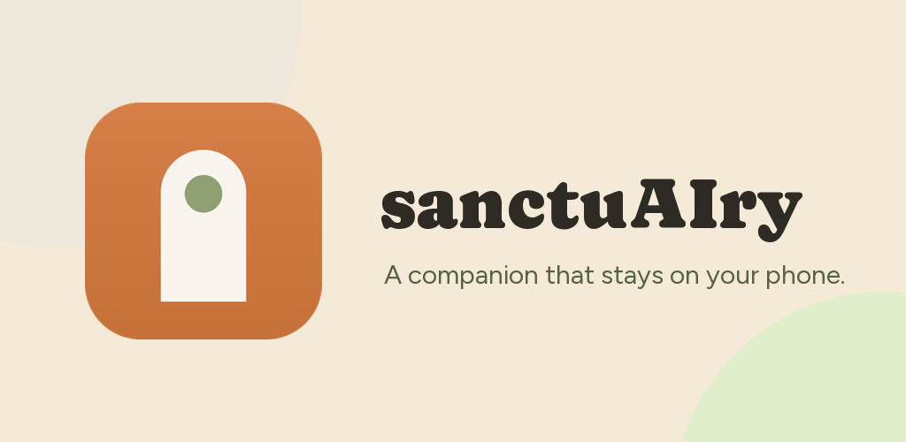

<p align="center">
  
</p>

<h1 align="center">sanctuAIry</h1>

<p align="center">
  <strong>A mental-health companion that runs entirely on your phone.</strong><br>
  No inference server. No telemetry on what you say. No network path for a single word of it.
</p>

<p align="center">
  
  
  
  
  
</p>

<p align="center">
  
  
  
  
  
</p>

---

> [!IMPORTANT]
> **Not a medical device.** sanctuAIry is a reflective journalling and conversation aid.
> It does not diagnose, treat, or provide crisis care, and it is not a substitute for a
> licensed clinician.

## The promise, and why it is structural

Everything the companion knows about you — every message, every diary entry, every fact it
has learned, every mood reading — lives in SQLite on your device and is never uploaded.

That is not a policy. It is a property of the build: inference happens locally on
**stock Gemma 4 E2B** via Google's LiteRT-LM runtime, and the only class that talks to a
server, [`UsageMetrics`](lib/services/usage_metrics.dart), **has no method that accepts a
string**. There is no parameter through which one of your sentences could reach it, by
accident or otherwise.

The app ships against the **stock Google model**, not a fine-tune. Voice comes from the
system instruction and few-shot exemplars in [`Persona`](lib/services/persona.dart), which
turned out to work better than a fine-tune trained on a corpus with escaping artefacts.
[`ModelProfile`](lib/services/model_profile.dart) still carries per-model sampler and
repair settings, so a fine-tune can be dropped back in without touching the app.

## Features

| | |
| --- | --- |
| 🧠 **On-device inference** | Gemma 4 E2B through LiteRT-LM. ~2.06 GB resident, no cloud calls |
| 📓 **Passcode diary lockbox** | Entries are shared with the companion only when you say so |
| 🔍 **Lightweight RAG** | BM25 retrieval + always-loaded facts, no embeddings, no second model |
| 💬 **Continuous memory** | It remembers you across sessions, and says so without citing sources |
| 🛟 **Crisis triage & guards** | Deterministic, in front of and behind every turn |
| 🔔 **Proactive check-ins** | One message after a long silence — never overnight, never twice a day |
| 🎨 **Two themes** | Sunlit and Dusk, from a hand-transcribed design system |
| 🌧️ **Ambient soundscapes** | Local loopable audio, no streaming |

## The lightweight RAG

The interesting part. A phone cannot afford a second model, and a generation pass costs
**15–30 seconds** on this hardware — so every layer here is deterministic, and the whole
thing runs in microseconds.

```
                    ┌──────────────────────── system instruction ────────────────────────┐
  Persona  ────────►│  who you are                                                       │
  MemoryStore ─────►│  pinned facts        (always loaded, ≤12, slot-keyed)              │
  NoteDigester ────►│  diary digests       (extractive, ≤4 sentences/entry)              │
  RelationshipLog ─►│  mood & topic trend                                                │
  SessionSummarizer►│  what happened last time                                           │
                    └───────────────────────────────────────────────────────────────────┘
                                              +
  user message ────► FactRanker  ──► relevant facts        ┐
                └──► ChunkStore  ──► BM25 over episodes    ├─► rides along with the turn
                                     (FTS5, Dart fallback) ┘
```

**Two tiers, not one.** Retrieval alone fails the obvious case: *"what is my name"* is not
lexically similar to *"my name is Padmanava"*. So durable facts are **always loaded** —
they are few, small, and relevant to every turn, costing a couple of hundred tokens against
a 4,096-token context. Retrieval handles the long tail, and usually returns nothing:
[`FactRanker.minScore`](lib/services/fact_ranker.dart) is tuned so an ordinary turn adds
nothing rather than padding the prompt with coincidence.

**BM25, not embeddings.** `k1=1.2, b=0.75`, with Porter stemming so *cheat* matches
*cheating* — a real bug once, when the query side was left unstemmed. An embedding model
would add 100–250 MB beside a footprint already at the edge of the device.

**FTS5 is not guaranteed on Android.** `sqflite` binds the *platform* SQLite, and whether
it carries FTS5 is a vendor decision. So the index is created **outside the migration**, in
a try/catch on every open, and [`DartBm25Scorer`](lib/services/memory_scorer.dart) is a
pure-Dart implementation of the same ranking for devices without it. An earlier version put
`CREATE VIRTUAL TABLE … fts5` inside the v3 migration; on a device without it the migration
rolled back, `user_version` stayed at 0, and the app hung on the splash screen forever.
**Migrations must contain nothing that can fail.**

**Everything is extracted, never generated.** Facts, events, topics, sentiment and even
first→third-person conversion are regex and lexicon work:

| Component | Does |
| --- | --- |
| [`FactExtractor`](lib/services/fact_extractor.dart) | Durable facts from chat and diary, slot-keyed so corrections overwrite |
| [`NoteDigester`](lib/services/note_digest.dart) | Diary entry → ≤4 salient sentences, extractive |
| [`SessionSummarizer`](lib/services/session_summarizer.dart) | Condenses a conversation when the app is backgrounded |
| [`Perspective`](lib/services/perspective.dart) | *"I have been swimming"* → *"They have been swimming"* |
| [`SentimentAnalyzer`](lib/services/sentiment_analyzer.dart) | Valence + arousal, with a negation window and a self-criticism lexicon |
| [`EventExtractor`](lib/services/event_extractor.dart) | *"interview tomorrow"* → a dated event the companion can follow up on |

[`Perspective`](lib/services/perspective.dart) is worth a note: a small model asked to
paraphrase your diary is exactly where invention starts, and left in the first person the
model adopts *your* voice as its own — on device it once answered good news with *"Hold up,
I just got that job offer?"*. A mechanical pronoun swap can only ever be awkward, never
false.

**One block, no citations.** All of the above renders into a single
[`MemoryCache.knowledgeBlock()`](lib/services/memory_cache.dart). It used to be four blocks
with four preambles, which cost tokens and taught the model to *attribute* — asked "do I
swim", it answered *"You mentioned swimming in your diary"*. A friend who has read your
diary does not cite it.

**Warm before the first message.** The cache is built at launch, so a turn costs **zero
database round trips**.

## Architecture

| Layer | Location |
| --- | --- |
| Responsive shells (600 dp split) | [lib/screens/home_shell.dart](lib/screens/home_shell.dart) |
| Chat, streaming, delivery ticks | [lib/widgets/sanctuary/chat_view.dart](lib/widgets/sanctuary/chat_view.dart) |
| Engine lifecycle | [lib/services/litert_service.dart](lib/services/litert_service.dart) |
| Working memory | [lib/services/memory_cache.dart](lib/services/memory_cache.dart) |
| Retrieval | [lib/services/memory_scorer.dart](lib/services/memory_scorer.dart) |
| Model download | [lib/services/model_download_service.dart](lib/services/model_download_service.dart) |
| Accounts (optional) | [lib/services/auth_service.dart](lib/services/auth_service.dart) |
| Design tokens | [lib/theme/tokens.dart](lib/theme/tokens.dart) |
| Wakelock + free-space channel | [MainActivity.kt](android/app/src/main/kotlin/com/sanctuairy/app/MainActivity.kt) |

`LiteRtService` is a singleton: it locates the model, brings up one `LiteLmEngine`, opens
one `LiteLmConversation`, and streams tokens. Engine creation is reentrancy-guarded —
two concurrent loads would double an already-marginal footprint.

## Model delivery

The model is **not** in this repository. It is ~2.41 GB, far past what an app bundle can
carry, so a fresh install downloads it once on first run.

- Hosted on **Cloudflare R2** (zero egress), configured in
  [`ModelCatalog`](lib/services/model_catalog.dart)
- **Resumable** — bytes land in a `.part` file and every attempt sends `Range`, so an
  interruption at 90% costs a reconnect rather than 2.2 GB of someone's data
- **Verified** — SHA-256 checked before the `.part` is promoted to a real model. A
  corrupted model does not fail politely; it aborts inside `nativeCreateEngine`
- **Wi-Fi by default**, with a free-space pre-flight check via a `StatFs` method channel

For development you can side-load instead:

```bash
adb push model.litertlm \
  /sdcard/Android/data/com.sanctuairy.app/files/models/model.litertlm
```

`findLocalModels()` checks the managed directory first, then external files, documents and
support. It also scans `/sdcard/Download` — **only in debug builds**, since scoped storage
denies a release build access to shared storage it did not create.

<details>
<summary><strong>What the <code>.litertlm</code> container actually holds</strong></summary>

Measured by reading the container header and the runtime's load log on-device:

| # | Section | Size |
| --- | --- | --- |
| 0 | `LlmMetadataProto` | 12 KB |
| 1 | `SP_Tokenizer` (SentencePiece) | 4.7 MB |
| 2 | `TFLiteModel` — `tf_lite_prefill_decode` | 1.16 GB |
| 3 | `TFLiteModel` — `tf_lite_embedder` | 204 MB |
| 4 | `TFLiteModel` — `tf_lite_per_layer_embedder` | 1.18 GB |

- Embedding width **1536**; per-layer embedder is **35 layers × 256** — the **PLE
  (Per-Layer Embeddings)** architecture behind Gemma 4's "E" effective-parameter models
- Vocabulary ≈ **262,144**, weights ≈ **int4**
- No vision or audio encoder, and **no GPU submodel** — CPU is the correct backend
- Runtime: `max_tokens: 4096`, `number_of_threads: 4`, fixed at conversion time

</details>

## Engineering notes

Four findings that cost real time and are worth not rediscovering.

<details>
<summary><strong>1. A one-word export flag caused 7 GB of RAM and an OOM kill</strong></summary>

The model was exported with `quantization_recipe='weight_only_wi4_afp32'`, which stores
INT4 on disk but computes in **FP32** — so at delegate-init XNNPACK dequantized every
weight tensor, an **8× expansion**. A small file with an enormous runtime footprint.

| | Broken | Re-exported | Google's official E2B |
| --- | --- | --- | --- |
| Peak RSS | 6,000–7,400 MB | **1,543 MB** | 1,733 MB |
| `DEQUANTIZE` ops | — | **0** | — |
| Result | `reason=3 (LOW_MEMORY)` | coherent reply | — |

The fix was `dynamic_wi4_afp32` — same bit width, integer kernels instead of an FP32
compute path. Load time also fell from 29–56 s to under a second with a warm cache.

</details>

<details>
<summary><strong>2. The runtime version must be forced across every subproject</strong></summary>

`flutter_litert_lm` pins `litertlm-android:0.10.0`, which predates Gemma 4 and aborts
inside `nativeCreateEngine`. Overriding in `:app` alone is not enough: Gradle packages one
version but each module still **compiles** against the version it declares, so the plugin's
bytecode kept referencing 0.10.0 signatures and died with `NoSuchMethodError`.

```gradle
subprojects { configurations.all { resolutionStrategy {
    force 'com.google.ai.edge.litertlm:litertlm-android:0.13.1'
} } }
```

**0.13.1, not latest** — 0.14.0 changed `Backend.CPU`'s constructor and breaks the plugin.
Verify with `javap` before bumping.

</details>

<details>
<summary><strong>3. Never hand-write chat turn tags</strong></summary>

The template lives **inside** the model, in `LlmMetadataProto`, and the runtime applies it.
This model uses `<|turn>` / `<turn|>` and has **no** `<start_of_turn>` tokens — verified by
scanning the embedded vocabulary. An earlier build wrapped prompts in Gemma-2/3 tags, which
tokenized as ordinary text and corrupted every prompt. Send plain text; pass the persona
through `systemInstruction`.

</details>

<details>
<summary><strong>4. The sampler seed was pinned to zero</strong></summary>

Upstream `flutter_litert_lm` never forwards the native `SamplerConfig.seed`, so every
conversation sampled from seed 0 and the companion returned byte-identical replies. Fixed
in the vendored fork at [packages/flutter_litert_lm](packages/flutter_litert_lm) — see
`VENDOR.md` for the diff and how to rebase.

"It repeats itself" turned out to mean **three unrelated bugs** over the project's life:
this one, a corrupted fine-tune corpus, and genuine within-reply looping now handled by
[`ReplySanitizer`](lib/services/reply_sanitizer.dart).

</details>

## Safety

- [`CrisisGuard`](lib/services/crisis_guard.dart) — tiered triage. Talk first, helpline
  last; a companion that answers distress with a phone number has ended the conversation
- [`LexicalGuard`](lib/services/guard.dart) — screens input narrowly and output for
  claims of being human, having a body, or giving medical advice
- Deterministic by design. A classifier model would be a second 15–30 s pass per turn

## Privacy & accounts

Sign-in is **required on Android, optional on iOS** — App Store guideline 5.1.1(v) forbids
mandatory accounts when core features do not need them.

What leaves the device is a set of **numbers against a date**: hours the app was open,
sessions, message count, diary-entry count. Never content. Usage is written to a local
ledger first so offline use still counts, synced as **absolute per-day totals** (idempotent
under retry, unlike increments), and deleted locally once the server acknowledges it.

Full policy: [docs/PRIVACY.md](docs/PRIVACY.md) · Rules: [firebase/firestore.rules](firebase/firestore.rules)

## Development

```bash
flutter pub get
flutter test                  # 214 tests
flutter build apk --release
adb install -r build/app/outputs/flutter-apk/app-release.apk
```

**Requirements** — Flutter 3.44+, Android SDK 36, NDK 28.2.13676358, `minSdk 24`, arm64.
Firebase is optional: without `android/app/google-services.json` the Gradle plugin is
skipped and the app runs local-only.

<details>
<summary><strong>Debugging on device</strong></summary>

An OOM kill produces no Dart stack trace and no tombstone, so check the exit reason first:

```bash
adb shell dumpsys activity exit-info com.sanctuairy.app     # reason=3 is LOW_MEMORY
adb shell "grep VmRSS /proc/$(adb shell pidof com.sanctuairy.app)/status"
adb logcat -v threadtime | grep -E "native|litert|tflite"
```

`LiteRtService.logToFile()` appends engine progress to app-private storage.

Measuring off-device with `pip install litert-lm-api` is a far faster loop than a 2.5 GB
push — but **do not use `resource.getrusage().ru_maxrss`**: under cgroup v2 it reports
allocated cgroup memory, not usage. Read `/proc/self/status` and `/proc/self/smaps_rollup`
instead; `Anonymous` is the figure that predicts device behaviour, since file-backed mmap
pages are evictable and repacked weights are not.

</details>

## Documentation

| | |
| --- | --- |
| [docs/RELEASE.md](docs/RELEASE.md) | Shipping: signing, model hosting, Firebase, Play |
| [docs/PRIVACY.md](docs/PRIVACY.md) | Privacy policy |
| [docs/MEMORY_GRAPH_ARCHITECTURE.md](docs/MEMORY_GRAPH_ARCHITECTURE.md) | Memory design |
| [ROADMAP.md](ROADMAP.md) | What is done and what is next |

## References

- [Blazing fast on-device GenAI with LiteRT-LM](https://developers.googleblog.com/blazing-fast-on-device-genai-with-litert-lm/) — PLE memory-mapping behaviour
- [litert-community/gemma-4-E2B-it-litert-lm](https://huggingface.co/litert-community/gemma-4-E2B-it-litert-lm) — official per-platform peak-memory table
- [Gemma 4 on LiteRT-LM](https://developers.google.com/edge/litert-lm/models/gemma-4) — the official `export_hf` command
- [ai-edge-quantizer](https://github.com/google-ai-edge/ai-edge-quantizer) — `DYNAMIC_WI4_AFP32` vs `WEIGHTONLY_WI4_AFP32`
- [litert-torch#994](https://github.com/google-ai-edge/litert-torch/issues/994) — E-series exports producing pad tokens

## License

[MIT](LICENSE) © 2026 Padmanava Pal

Gemma is provided by Google under the [Gemma Terms of Use](https://ai.google.dev/gemma/terms).
Fonts (Caprasimo, Figtree) ship under the SIL Open Font License; texts are in
[assets/fonts](assets/fonts).
